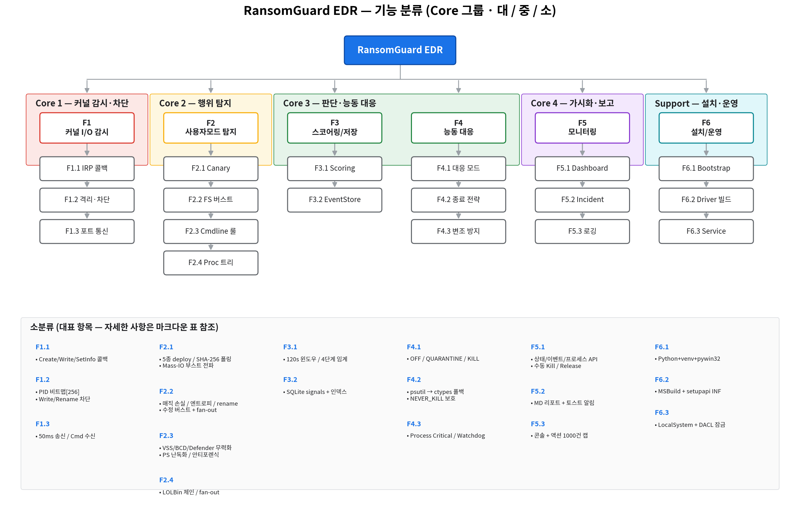

# RansomGuard EDR — 기능명세서

> 분류 체계: **대분류(Major) → 중분류(Group) → 소분류(Feature)**
> 작성일: 2026-05-21 · 대상: Windows 11 x64 · 버전: 0.1 (프로토타입)

---

## 1. 분류 요약 (Top-down)

| 대분류 ID | 대분류 명 | 중분류 수 | 소분류 수 | 책임 컴포넌트 |
|-----------|-----------|----------:|----------:|---------------|
| F1 | 커널 모드 감시 (파일 I/O + 프로세스/레지스트리 콜백) | 4 | 13 | `minifilter/RansomGuard.{c,h}`, `detectors/minifilter_bridge.py` |
| F2 | 사용자 모드 행위 탐지 | 5 | 16 | `detectors/canary.py`, `mass_io.py`, `process_cmdline.py`, `process_watcher.py`, `process_kernel.py`, `registry_kernel.py` |
| F3 | 스코어링 & 이벤트 저장 | 2 | 6 | `scoring.py`, `event_store.py` |
| F4 | 능동 대응 (Active Response) | 3 | 8 | `responder.py`, `tamper.py` |
| F5 | 모니터링 & 사용자 가시성 | 3 | 11 | `dashboard/app.py`, `incident_report.py` |
| F6 | 시스템 설치 & 운영 | 3 | 8 | `scripts/*.ps1`, `service.py`, `watchdog_service.py` |

총 **6 대분류 / 20 중분류 / 62 소분류**

### 1.1 Core 그룹핑 (F1~F6 → Core 1~4 / Support)

대분류 F1~F6 은 책임 단위로 묶으면 **4 개의 Core 모듈 + 1 개의 Support**
계층으로 재구성된다 (아키텍처 문서의 Core 모델과 동일한 그룹핑 기준).
탐지 파이프라인은 Core 1 → 2 → 3 으로 흐르고, Core 3 이 Core 1 에
격리/종료 명령을 피드백하며, Core 4 가 결과를 가시화한다.

| Core | 이름 | 포함 기능군 |
|------|------|-------------|
| **Core 1** | 커널 감시·차단 | F1 |
| **Core 2** | 행위 탐지 | F2 |
| **Core 3** | 판단·능동 대응 | F3 + F4 |
| **Core 4** | 가시화·보고 | F5 |
| **Support** | 설치·운영 | F6 |

---

## 2. F1 — 커널 모드 파일 I/O 감시

| 중분류 ID | 중분류 | 소분류 ID | 소분류 (기능) | 설명 | 산출/소비 시그널 |
|-----------|--------|-----------|---------------|------|------------------|
| F1.1 | IRP 콜백 등록 | F1.1.1 | Create 콜백 | `IRP_MJ_CREATE` Post 콜백, 유저모드 + 성공 open 만 emit | `RgEventCreate` |
|      |              | F1.1.2 | Write 콜백 | Pre/Post Write, 4KB 이상만 throttle | `RgEventWrite` |
|      |              | F1.1.3 | SetInformation 콜백 | rename/delete 식별 + Post emit | `RgEventSetInfo` |
| F1.2 | 격리 & 차단 | F1.2.1 | PID 격리 비트맵 | 256 슬롯 선형 스캔, push-lock 보호 | — |
|      |              | F1.2.2 | 격리 PID Write 차단 | `STATUS_ACCESS_DENIED` 반환 | `RgEventBlocked` |
|      |              | F1.2.3 | 격리 PID Rename/Delete 차단 | SetInformation Pre 단계 거부 | `RgEventBlocked` |
| F1.3 | 유저모드 통신 | F1.3.1 | 통신 포트 (\\RansomGuardPort) | 단일 리스너, altitude 385201, 프로토콜 v2 | — |
|      |              | F1.3.2 | 이벤트 송신 (50ms 타임아웃) | IRP 멈춤 방지, 초과 시 drop | RG_EVENT 스트림 (8가지 종류) |
|      |              | F1.3.3 | 컨트롤 명령 수신 (6가지) | Quarantine/Release/Ping/ProtectPid/UnprotectPid/FlushQuarantine | RG_COMMAND/REPLY |
| F1.4 | 커널 콜백 v2 확장 | F1.4.1 | 프로세스 생성/종료 콜백 | `PsSetCreateProcessNotifyRoutineEx` 등록, cmdline 수집 | `RgEventProcessStart/Exit` |
|      |                   | F1.4.2 | 레지스트리 변경 콜백 | `CmRegisterCallbackEx` + watch 리스트 사전 필터 | `RgEventRegistry` |
|      |                   | F1.4.3 | 핸들 access 박탈 (Self-Defense) | `ObRegisterCallbacks` 로 보호 PID 핸들 access mask strip | `RgEventTamperBlocked` |
|      |                   | F1.4.4 | 보호 PID 비트맵 | `ProtectedPids[16]`, push-lock 보호 | — |

---

## 3. F2 — 사용자 모드 행위 탐지

| 중분류 ID | 중분류 | 소분류 ID | 소분류 (기능) | 가중치 | 심각도 | 트리거 조건 |
|-----------|--------|-----------|---------------|-------:|--------|-------------|
| F2.1 | Canary 트립와이어 | F2.1.1 | Canary 파일 자동 배치 | — | — | 시작 시 watch 디렉터리에 5종 deploy |
|      |                    | F2.1.2 | SHA-256 폴링 (1.5s) | 80 | CRITICAL | 해시 불일치 / 파일 삭제 |
|      |                    | F2.1.3 | Mass-IO 부스트 전파 | × 1.5 | — | 30초간 mass_io 임계 강화 |
| F2.2 | 파일 시스템 버스트 | F2.2.1 | 매직바이트 손실 | 12 | HIGH | 이전 PE/PDF/Office → 인식 불가 |
|      |                    | F2.2.2 | 고엔트로피 쓰기 | 8 | MEDIUM | Shannon ≥ 7.5 (boost: 6.8) |
|      |                    | F2.2.3 | 의심 확장자 rename | 15 | HIGH | `.encrypted/.locked/.wcry/…` |
|      |                    | F2.2.4 | 수정 버스트 + fan-out | 25+20×n | HIGH | 10초 안 15+ 파일, 확장자/디렉터리 다양성 보너스 |
| F2.3 | 프로세스 커맨드라인 | F2.3.1 | VSS 섀도카피 삭제 | 70 | CRITICAL | `vssadmin/wmic/wbadmin` |
|      |                    | F2.3.2 | BCD 부트 조작 | 70 | CRITICAL | `bcdedit safeboot/recoveryenabled` |
|      |                    | F2.3.3 | Defender 무력화 | 60 | HIGH | `Set-MpPreference`, 서비스 중지 |
|      |                    | F2.3.4 | 안티포렌식 (로그 삭제) | 50 | HIGH | `wevtutil cl`, `fsutil usn deletejournal` |
|      |                    | F2.3.5 | 방화벽/BitLocker 비활성 | 50 | HIGH | `netsh advfirewall`, `manage-bde -off` |
|      |                    | F2.3.6 | 지속화 (Run/Schtasks) | 40 | MEDIUM | Run 키 쓰기, `schtasks /create` |
|      |                    | F2.3.7 | PowerShell 난독화 | 35 | MEDIUM | `-EncodedCommand`, `ExecutionPolicy bypass` |
| F2.4 | 프로세스 트리 휴리스틱 | F2.4.1 | LOLBin 부모-자식 체인 | 40 | HIGH | Office/Adobe/Browser → script host |
|      |                    | F2.4.2 | 자식 fan-out | 30 | MEDIUM | 동일 부모, 5s 내 12+ 자식 |
|      |                    | F2.4.3 | 단일 프로세스 쓰기 버스트 | 20 | MEDIUM | 2s 윈도우 50MB+ 쓰기 |
| F2.5 | 커널 콜백 기반 탐지 (v2) | F2.5.1 | `process_kernel.py` cmdline 룰 | 35~70 | HIGH/CRITICAL | WMI 없이 `RgEventProcessStart` 의 Extra(cmdline)에 `evaluate_cmdline` 적용 |
|      |                          | F2.5.2 | `registry_kernel.py` 키 분류 | 30~80 | MED/CRITICAL | RansomGuard/Defender/Run/IFEO/Schtasks 등 watch 리스트 매핑 |
|      |                          | F2.5.3 | tamper_blocked 시그널 | 50 | HIGH | `ObCallback` 핸들 access strip 발생 시 |

---

## 4. F3 — 스코어링 & 이벤트 저장

| 중분류 ID | 중분류 | 소분류 ID | 소분류 (기능) | 설명 |
|-----------|--------|-----------|---------------|------|
| F3.1 | 스코어링 엔진 | F3.1.1 | 슬라이딩 윈도우 합산 | 120초 윈도우 가중치 누적 |
|      |               | F3.1.2 | 임계값 분류 | LOW=30 / MED=60 / HIGH=100 / CRIT=150 |
|      |               | F3.1.3 | 리스너 브로드캐스트 | `(signal, score, level)` 다중 구독, 예외 격리 |
| F3.2 | 이벤트 영구 저장 | F3.2.1 | SQLite 스키마 | `signals` 테이블 + 인덱스 |
|      |                  | F3.2.2 | 메타데이터 직렬화 | `json.dumps(default=str)` 안전 |
|      |                  | F3.2.3 | 조회 API | `recent(N)`, `stats()` |

---

## 5. F4 — 능동 대응 (Active Response)

| 중분류 ID | 중분류 | 소분류 ID | 소분류 (기능) | 설명 |
|-----------|--------|-----------|---------------|------|
| F4.1 | 대응 모드 | F4.1.1 | OFF 모드 | 관찰만, 동작 없음 |
|      |           | F4.1.2 | QUARANTINE 모드 | 커널 격리만, 종료 없음 |
|      |           | F4.1.3 | KILL 모드 | 격리 + TerminateProcess |
| F4.2 | 종료 전략 | F4.2.1 | psutil.kill 1차 시도 | 일반 케이스 처리 |
|      |           | F4.2.2 | ctypes TerminateProcess 폴백 | `OpenProcess(PROCESS_TERMINATE)` 직접 호출 |
|      |           | F4.2.3 | NEVER_KILL 보호 목록 | lsass/csrss/python.exe 등 절대 제외 |
| F4.3 | 변조 방지 | F4.3.1 | 자가 변조 방어 (`tamper.py`) | `RtlSetProcessIsCritical`, 핸들 보호 |
|      |           | F4.3.2 | Watchdog 서비스 | `watchdog_service.py`, 5s heartbeat, 크래시 시 재기동 |

---

## 6. F5 — 모니터링 & 사용자 가시성

| 중분류 ID | 중분류 | 소분류 ID | 소분류 (기능) | 설명 |
|-----------|--------|-----------|---------------|------|
| F5.1 | Flask 대시보드 | F5.1.1 | 실시간 점수 패널 | `/api/status` 폴링 |
|      |               | F5.1.2 | 최근 시그널 테이블 | `/api/events` 최근 100건 |
|      |               | F5.1.3 | 프로세스 스냅샷 | `/api/processes` psutil 60개 |
|      |               | F5.1.4 | 수동 Kill/Release 버튼 | `/api/kill`, `/api/release` |
|      |               | F5.1.5 | Heartbeat 엔드포인트 | `/api/heartbeat` (watchdog 폴링용, 200 OK) |
|      |               | F5.1.6 | 사고 보고서 조회 API | `/api/reports`, `/api/reports/<filename>` |
| F5.2 | 인시던트 리포트 | F5.2.1 | Markdown 리포트 자동 생성 | KillAction → `incident_<ts>_pid<n>.md` |
|      |                 | F5.2.2 | 토스트 알림 (브라우저) | 2.5s 폴링, 10s auto-dismiss |
|      |                 | F5.2.3 | OS 데스크톱 알림 | `win10toast` / `BurntToast` / `MessageBoxW` |
| F5.3 | 운영 로깅 | F5.3.1 | 콘솔 시그널 출력 | 가독성 포맷 |
|      |           | F5.3.2 | 리스폰더 액션 이력 | 최대 1000건, `/api/actions` |

---

## 7. F6 — 시스템 설치 & 운영

| 중분류 ID | 중분류 | 소분류 ID | 소분류 (기능) | 설명 |
|-----------|--------|-----------|---------------|------|
| F6.1 | 부트스트랩 | F6.1.1 | Python 3.12 설치 (winget) | `bootstrap.ps1` |
|      |            | F6.1.2 | .venv 자동 구성 | requirements.txt 설치 |
|      |            | F6.1.3 | pywin32 post-install | COM 등록 |
| F6.2 | 드라이버 빌드/설치 | F6.2.1 | MSBuild 자동 호출 | `build_driver.ps1`, vswhere 탐색 |
|      |                    | F6.2.2 | INF 기반 설치 | `setupapi DefaultInstall 132` |
|      |                    | F6.2.3 | 서비스 등록 (sc.exe) | `RansomGuard` 서비스 |
| F6.3 | Windows 서비스 | F6.3.1 | Agent 서비스 등록 | `install_services.ps1`, LocalSystem |
|      |                | F6.3.2 | DACL 잠금 | SYSTEM/Admins 만 접근 |

---

## 8. 외부 인터페이스 요약

| ID | 인터페이스 | 방향 | 설명 |
|----|------------|------|------|
| IF-1 | `\RansomGuardPort` (FltCommunicationPort, v2) | 커널 ↔ 유저모드 | `RG_EVENT`(8종)/`RG_COMMAND`(6종) 바이너리 프로토콜 |
| IF-2 | `http://127.0.0.1:5000/` | 유저모드 → 브라우저 | Flask + JSON API (`/api/heartbeat` 포함) |
| IF-3 | SQLite 파일 `detector.db` | 유저모드 자체 | 영구 저장소 |
| IF-4 | `./reports/incident_*.md` | 유저모드 → 파일 시스템 | 인시던트 리포트 |
| IF-5 | WMI `Win32_Process` 구독 | 유저모드 → OS | 프로세스 생성 이벤트 (`process_cmdline.py`) |
| IF-6 | `PsSetCreateProcessNotifyRoutineEx` (커널 콜백) | 커널 → 유저모드 (v2) | 프로세스 생성/종료 동기 감지 (`process_kernel.py`) |
| IF-7 | `CmRegisterCallbackEx` (커널 콜백) | 커널 → 유저모드 (v2) | 레지스트리 변경 감지 (`registry_kernel.py`) |
| IF-8 | SCM 서비스 + HKLM 파라미터 | OS → 유저모드 | `RansomGuardAgent` / `RansomGuardWatchdog` 서비스 |

---

## 9. 비기능 요구사항 (요약)

| 항목 | 기준 |
|------|------|
| 응답 시간 | HIGH/CRITICAL 시그널 → 격리/종료 1초 이내 |
| 커널 안정성 | `FltSendMessage` 50ms 타임아웃, 유저모드 정체 시에도 IRP 안 막힘 |
| 메모리 상한 | `MAX_TRACKED_FILES=20000`, 액션 이력 1000건 cap |
| 위양성 보호 | `NEVER_KILL` 하드코딩, `--mode quarantine` 단계적 튜닝 가능 |
| 가용성 | Watchdog 서비스로 5초 미만 다운타임 자동 복구 |

