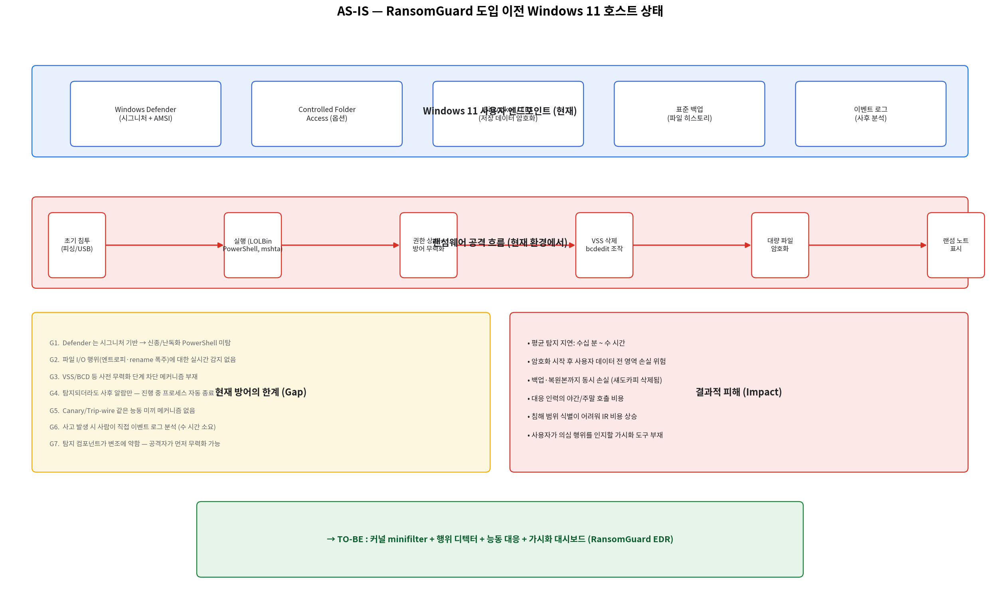

# AS-IS — RansomGuard EDR 도입 이전 현황 분석

> 대상: Windows 11 x64 사용자 엔드포인트
> 작성일: 2026-05-21
> 비교 기준: 본 프로젝트(`RansomGuard EDR`)가 부재할 때의 방어/탐지/대응 능력

---

## 1. 현재 환경 (As-Is Environment)

| 계층 | 기존 자산 | 역할 | 한계 |
|------|-----------|------|------|
| OS 내장 방어 | Windows Defender (시그니처+AMSI) | 알려진 악성코드 차단 | 신종 / 난독화 PowerShell 미탐 |
| OS 옵션 | Controlled Folder Access | 보호 폴더 변경 차단 | 사용자 화이트리스트 수동 관리 부담 |
| 저장 보호 | BitLocker / EFS | 디스크 단위 암호화 | 실행 중 사용자 키 노출 시 무력 |
| 데이터 백업 | 파일 히스토리 / OneDrive | 사용자 데이터 복사 | 섀도카피·로컬 백업까지 함께 삭제됨 |
| 사후 분석 | 이벤트 로그 / 4688 | 침해 후 포렌식 | 실시간 가시화 없음, 사람이 분석 |

---

## 2. 현재 랜섬웨어 공격 흐름과 방어 격차

```
초기 침투(피싱)
    ▼
LOLBin 실행 (powershell -enc / mshta)
    ▼
권한 상승 + 방어 무력화      ← Defender 실시간 보호 OFF / 방화벽 OFF
    ▼
VSS 섀도카피 삭제 (vssadmin)  ← 복구 경로 제거
    ▼
대량 파일 암호화 + rename     ← 사용자 데이터 손실
    ▼
랜섬 노트 표시
```

위 흐름의 **각 단계에서 현재 환경이 놓치는 신호**:

| 공격 단계 | 현재 감지 가능 여부 | 사유 |
|-----------|---------------------|------|
| LOLBin 부모-자식 (Office → PowerShell) | ❌ | 정적 시그니처 미일치 |
| `-EncodedCommand` 난독화 | △ | AMSI 일부 탐지, 정책 부재 시 우회 |
| `vssadmin delete shadows` | △ | 이벤트 로그에 남지만 실시간 차단 X |
| 고엔트로피 대량 쓰기 | ❌ | 파일 I/O 행위 모니터 없음 |
| `.encrypted` 일괄 rename | ❌ | 단순 rename 은 정상 동작 구분 불가 |
| 백업 / 섀도카피 삭제 | ❌ | OS 가 합법 명령으로 처리 |
| 대응(프로세스 종료) | ❌ | 자동 차단 없음, 알람만 |

---

## 3. 식별된 문제점 (Gap Analysis)

| ID | 문제 | 영향도 | 근본 원인 |
|----|------|--------|-----------|
| G1 | Defender 시그니처 의존 | HIGH | 신종 / packer / fileless 회피 |
| G2 | 행위 기반 실시간 파일 I/O 감시 부재 | CRITICAL | OS 가 노출하는 일반 API 만으로는 부족 |
| G3 | VSS/BCD 등 사전 무력화 차단 부재 | CRITICAL | 합법 시스템 명령으로 분류 |
| G4 | 진행 중 프로세스 자동 종료 메커니즘 부재 | HIGH | EDR 컴포넌트 없음 |
| G5 | Trip-wire / Canary 메커니즘 부재 | MEDIUM | 별도 도구 도입 필요 |
| G6 | 사람이 사후 로그를 분석 | HIGH | SOAR/SIEM 없음, 시간 손실 |
| G7 | 탐지/대응 컴포넌트 자체 변조 방지 부재 | HIGH | 대상 머신에서 무력화 가능 |
| G8 | 사용자 가시성 (실시간 알림) 부재 | MEDIUM | 사용자가 즉시 인지 불가 |

---

## 4. 정량 추정 (현재 환경에서의 기대 피해)

| 지표 | 값 | 비고 |
|------|----|------|
| 평균 탐지 지연 (Mean Time to Detect) | 30분 ~ 수시간 | 사고 인지 시점 기준 |
| 평균 대응 시작 시간 (MTTR) | 수십 분 ~ 1일 | 야간/주말 호출 영향 |
| 데이터 손실 위험 범위 | 사용자 프로필 + 매핑 드라이브 | 권한 범위 전체 |
| 백업 동시 손실 확률 | HIGH | VSS 삭제 단계가 차단되지 않음 |

---

## 5. AS-IS 다이어그램



---

## 6. TO-BE 로의 전환 방향 (요약)

| Gap | 본 프로젝트의 대응 |
|-----|--------------------|
| G1, G2 | **커널 minifilter** + 사용자모드 **행위 디텍터** (canary/mass_io/cmdline/process) — `RansomGuard.c`, `detectors/*.py` |
| G3 | **`process_cmdline.py` RULES** — VSS/BCD/Defender/PowerShell 룰셋 |
| G4 | **`ProcessResponder`** — `quarantine` / `kill` 모드, NEVER_KILL 보호 |
| G5 | **`CanaryDetector`** — 5종 트립와이어, mass_io 부스트 전파 |
| G6 | **Flask Dashboard + Incident Reporter** — 실시간 가시화, MD 리포트 자동 생성 |
| G7 | **`tamper.py` + `watchdog_service.py`** — Process Critical, 5s heartbeat 자동 복구 |
| G8 | **OS Toast/MessageBox 알림 + 브라우저 토스트** — `incident_report._notify_*` |

위 매핑은 **기능명세서 F1 ~ F6** 와 1:1 대응됩니다 (자세한 내용은 `01_기능명세서.md` 참조).
