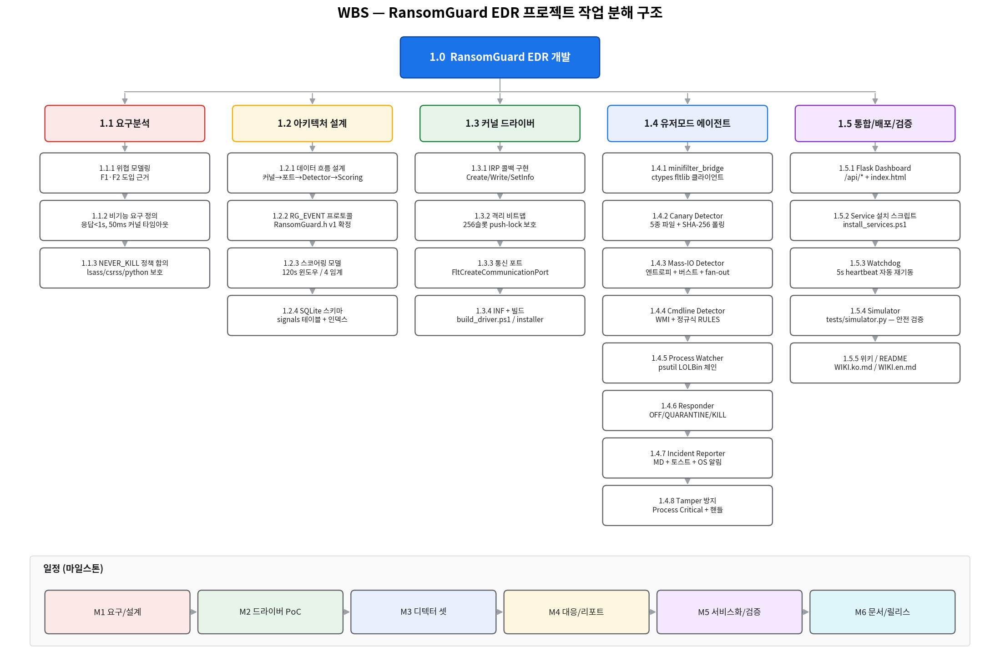

# WBS — RansomGuard EDR 작업 분해 구조

> WBS (Work Breakdown Structure) — 프로젝트를 산출물 중심으로 분해
> 작성일: 2026-05-21
> 코드 ID 체계: `Phase.WorkPackage.Activity` (예: `1.4.3`)

---

## 1. 최상위 (Level 0 ~ 1)

| 코드 | 산출물 / 단계 | 기간(추정) | 산출물 | 의존 |
|------|---------------|-----------:|--------|------|
| 1.0  | **RansomGuard EDR 개발** | 6주 | 본 저장소 전체 | — |
| 1.1  | 요구분석 & 위협 모델링 | 0.5주 | 위협 카탈로그, NFR | — |
| 1.2  | 아키텍처 설계 | 0.5주 | 데이터 흐름도, `RG_EVENT` 스펙 | 1.1 |
| 1.3  | 커널 드라이버 구현 | 1.5주 | `RansomGuard.sys`, INF, CAT | 1.2 |
| 1.4  | 유저모드 에이전트 | 2주 | `agent.py` + `detectors/*` + `responder.py` | 1.2 |
| 1.5  | 통합 / 배포 / 검증 | 1.5주 | Service 등록, 시뮬레이터 통과, 위키 | 1.3, 1.4 |

---

## 2. Level 2 — 작업 패키지 (Work Packages)

### 1.1 요구분석 & 위협 모델링

| 코드 | 활동 | 산출물 | 책임 컴포넌트 |
|------|------|--------|---------------|
| 1.1.1 | 랜섬웨어 공격 단계 위협 모델링 | F1·F2 도입 근거표 | (`docs/WIKI.ko.md` §1) |
| 1.1.2 | 비기능 요구 (응답<1s, 50ms 타임아웃) 정의 | NFR 표 | — |
| 1.1.3 | NEVER_KILL 정책 합의 | 보호 프로세스 리스트 | `responder.py:NEVER_KILL` |
| 1.1.4 | 운영 모드 정의 (off/quarantine/kill) | CLI 사양 | `agent.py:parse_args` |

### 1.2 아키텍처 설계

| 코드 | 활동 | 산출물 |
|------|------|--------|
| 1.2.1 | 컴포넌트 데이터 흐름 설계 (커널→Bridge→Detector→Scoring→Responder) | 아키텍처 다이어그램 |
| 1.2.2 | `RG_EVENT`(8종) / `RG_COMMAND`(6종) 바이너리 프로토콜 v2 확정 | `minifilter/RansomGuard.h` |
| 1.2.3 | 스코어링 모델 (120s 윈도우, 4단계 임계) | `scoring.py` 상수 |
| 1.2.4 | SQLite 스키마 + 인덱스 설계 | `event_store.py` |
| 1.2.5 | Flask API 계약 (/api/status/events/processes/...) | `dashboard/app.py` |

### 1.3 커널 드라이버

| 코드 | 활동 | 산출물 | 비고 |
|------|------|--------|------|
| 1.3.1 | `RgPostCreate` 콜백 | `RansomGuard.c` | 유저모드+성공 open 만 emit |
| 1.3.2 | `RgPreWrite` / `RgPostWrite` | 동 | 4KB 미만 throttle |
| 1.3.3 | `RgPreSetInfo` / `RgPostSetInfo` | 동 | Rename / Delete 식별 |
| 1.3.4 | 격리 비트맵 (`QuarantinedPids[256]`) | 동 | push-lock 보호 |
| 1.3.5 | `\RansomGuardPort` 통신 포트 | 동 | 단일 리스너, altitude 385201 |
| 1.3.6 | `FltSendMessage` (50ms 타임아웃) | 동 | 유저모드 정체 시 drop |
| 1.3.7 | `RgPortMessage` 컨트롤 디스패치 | 동 | Quarantine/Release/Ping |
| 1.3.8 | INF + Build 스크립트 | `RansomGuard.inf`, `scripts/build_driver.ps1` | vswhere → MSBuild |
| 1.3.9 | 드라이버 설치/제거 스크립트 | `scripts/install_driver.ps1`, `uninstall_driver.ps1` | — |

### 1.4 유저모드 에이전트

| 코드 | 활동 | 산출물 |
|------|------|--------|
| 1.4.1 | `minifilter_bridge.py` (ctypes fltlib) | 커널 이벤트 수신, write/rename 버스트 |
| 1.4.2 | `CanaryDetector` (5종 파일, SHA-256 폴링) | `detectors/canary.py` |
| 1.4.3 | `MassIODetector` (엔트로피·매직·rename·fan-out) | `detectors/mass_io.py` |
| 1.4.4 | `ProcessCmdlineDetector` (WMI 정규식 RULES) | `detectors/process_cmdline.py` |
| 1.4.5 | `ProcessWatcher` (psutil LOLBin 체인) | `detectors/process_watcher.py` |
| 1.4.6 | `ProcessKernelDetector` (커널 콜백 cmdline 룰, WMI 미사용) | `detectors/process_kernel.py` |
| 1.4.7 | `RegistryKernelDetector` (커널 콜백 레지스트리 watch) | `detectors/registry_kernel.py` |
| 1.4.8 | `ScoringEngine` + `EventStore` | `scoring.py`, `event_store.py` |
| 1.4.9 | `ProcessResponder` (OFF/QUARANTINE/KILL) | `responder.py` |
| 1.4.10 | `IncidentReporter` (MD + 토스트 + OS 알림) | `incident_report.py` |
| 1.4.11 | `tamper.py` (Process Critical, DACL 강화) | `tamper.py` |

### 1.5 통합 / 배포 / 검증

| 코드 | 활동 | 산출물 |
|------|------|--------|
| 1.5.1 | Flask Dashboard (`/api/*`, index.html) | `dashboard/app.py`, `templates/`, `static/` |
| 1.5.2 | Windows Service 설치 스크립트 | `scripts/install_services.ps1`, `scripts/uninstall_services.ps1` |
| 1.5.3 | Watchdog 서비스 (5s heartbeat) | `watchdog_service.py`, `service.py` |
| 1.5.4 | 안전 시뮬레이터 (`vss/bcd/encrypt/canary/full`) | `tests/simulator.py`, `demo_inproc.py` |
| 1.5.5 | 위키 / README (KR + EN) | `README.md`, `docs/WIKI.ko.md`, `docs/WIKI.en.md` |
| 1.5.6 | 부트스트랩 스크립트 (Python + venv + winget) | `scripts/bootstrap.ps1`, `install.ps1`, `_common.ps1` |

---

## 3. 일정 (마일스톤)

| 마일스톤 | 완료 시점 | 기준 산출물 |
|----------|-----------|-------------|
| M1 — 요구 / 설계 완료 | W1 종료 | RG_EVENT 스펙 확정, NFR 표 |
| M2 — 드라이버 PoC | W3 종료 | `RansomGuard.sys` 로드 + 이벤트 수신 |
| M3 — 디텍터 셋 통합 | W4 종료 | 4개 디텍터 + Scoring 엔진 통합 |
| M4 — 대응 / 리포트 완성 | W5 종료 | Quarantine + Kill + MD 리포트 + OS 알림 |
| M5 — 서비스화 / 검증 | W6 중반 | LocalSystem 서비스 + Watchdog + Simulator 통과 |
| M6 — 문서 / 릴리스 | W6 종료 | 위키 한·영 + README |

---

## 4. 의존성 매트릭스

```
1.1 ──► 1.2 ──┬──► 1.3 ──┐
              │           ├──► 1.5
              └──► 1.4 ──┘
```

- `1.3` (커널 드라이버) 와 `1.4` (유저모드) 는 `1.2.2` (RG_EVENT 스펙) 확정 후 병렬 진행 가능.
- `1.5` (통합) 은 두 트랙이 모두 PoC 단계를 통과한 뒤 시작.

---

## 5. 책임 (RACI 요약)

| 작업군 | 주요 산출 | 책임(R) | 검토(C) |
|--------|-----------|---------|---------|
| 1.3 커널 | `RansomGuard.sys` | 드라이버 개발자 | 보안 검토 |
| 1.4 유저모드 | `agent.py` 외 Python | 백엔드 개발자 | QA |
| 1.5 통합 | 서비스/시뮬레이터/위키 | DevOps + QA | 보안 검토 |

---

## 6. WBS 다이어그램


