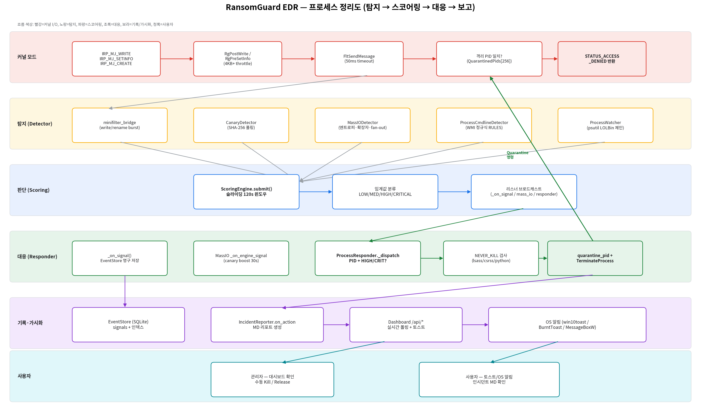

# RansomGuard EDR — 프로세스 정리도

> 본 문서는 **이벤트 발생 → 탐지 → 점수 산정 → 능동 대응 → 기록·가시화 → 사용자 통지** 까지의
> 전체 처리 흐름을 6 개 레인(swim-lane)으로 정리한다.
> 작성일: 2026-05-21

---

## 1. 한눈에 보기 (Top-level)

```
[커널 minifilter]──RG_EVENT──▶[Detector Bridge]──Signal──▶[ScoringEngine]
                                                              │
                                            (listener 3개) ◀──┘
                                            │      │      │
                                            ▼      ▼      ▼
                                   _on_signal  mass_io   ProcessResponder
                                   (저장)     (boost)    (격리+종료)
                                            │             │
                                            ▼             ▼
                                      EventStore     IncidentReporter
                                      (SQLite)      (MD + OS 알림)
                                            │             │
                                            └──▶ Dashboard ◀──┘
```

---

## 2. 레인별 처리 단계 (Swim-lane)

### 레인 1 — 커널 모드 (`minifilter/RansomGuard.c`)

| 단계 | 함수 / 객체 | 처리 |
|------|-------------|------|
| K1 | I/O 매니저 | `IRP_MJ_CREATE / WRITE / SET_INFORMATION` 발생 |
| K2 | `RgPreWrite` | 격리 PID? → `STATUS_ACCESS_DENIED`, `RgEventBlocked` emit |
| K3 | `RgPostWrite` | 4KB 이상만 throttle, `IoStatus.Information` → `WriteBytes` |
| K4 | `RgPreSetInfo` | Rename/Delete 분류, 격리 PID 면 차단 |
| K5 | `RgSendEvent` | `RG_EVENT` non-paged pool 할당 → `FltSendMessage` (50ms 타임아웃) |

### 레인 2 — 사용자모드 탐지 (`detectors/*`)

| 단계 | 객체 | 처리 |
|------|------|------|
| D1 | `MinifilterBridge._receive_loop` | `FilterGetMessage` 블로킹 → `_handle_event` |
| D2 | `_account_write / _account_rename` | PID별 슬라이딩 윈도우 (75MB/4s, 20개/5s) |
| D3 | `CanaryDetector` | 1.5s SHA-256 폴링 → 불일치 시 CRITICAL emit |
| D4 | `MassIODetector` | 엔트로피 / 매직 / rename / 버스트 / fan-out |
| D5 | `ProcessCmdlineDetector` | WMI `Win32_Process` 이벤트 → 정규식 RULES |
| D6 | `ProcessWatcher` | psutil 1Hz polling → LOLBin 체인, fan-out, 쓰기 버스트 |

### 레인 3 — 판단 (`scoring.py`)

| 단계 | 함수 | 처리 |
|------|------|------|
| S1 | `ScoringEngine.submit(signal)` | append + 만료 제거 (120s) |
| S2 | `current_score()` | 활성 윈도우 가중치 합산 |
| S3 | `current_level()` | INFO < LOW(30) < MED(60) < HIGH(100) < CRIT(150) |
| S4 | listener 브로드캐스트 | 3개 리스너 호출, 예외 격리 (한 리스너 실패가 엔진 다운시키지 않음) |

### 레인 4 — 대응 (`responder.py`)

| 단계 | 함수 | 처리 |
|------|------|------|
| R1 | `_dispatch(sig, score, level)` | HIGH/CRITICAL + PID → `_respond_to_pid`; score ≥ CRIT → `_sweep_window` |
| R2 | `_respond_to_pid` | self-pid 거부 → NEVER_KILL 체크 |
| R3 | 격리 단계 | `minifilter.quarantine_pid(pid)` → 커널 비트맵 등록 |
| R4 | 종료 단계 | `psutil.kill()` → 실패 시 ctypes `OpenProcess(PROCESS_TERMINATE)` |
| R5 | `_record(action)` | 액션 1000건 cap, `on_action(KillAction)` 콜백 |

### 레인 5 — 기록 / 가시화

| 단계 | 객체 | 처리 |
|------|------|------|
| L1 | `Agent._on_signal` | 콘솔 출력 + `EventStore.record(...)` |
| L2 | `EventStore` | SQLite `signals` 테이블 insert |
| L3 | `IncidentReporter.on_action` | No-op skip → MD 빌드 → `incident_<ts>_pid<n>.md` 파일 작성 |
| L4 | Dashboard `/api/*` | 2.5초 폴링, 새 인시던트는 토스트 |
| L5 | `_notify_user` | Windows: `win10toast` → BurntToast → `MessageBoxW` 폴백 |

### 레인 6 — 사용자

| 단계 | 행위 |
|------|------|
| U1 | 관리자 — 대시보드에서 점수 / 시그널 / 프로세스 확인 |
| U2 | 관리자 — 의심 PID 수동 `Kill` 또는 `Release` |
| U3 | 일반 사용자 — OS 토스트 알림 수신, MD 리포트 확인 |

---

## 3. 시그널 종류와 처리 분기

| 시그널 | 발신처 | 가중치 | 분기 |
|--------|--------|-------:|------|
| `canary_modified` | `canary.py` | 80 | mass_io 부스트 + responder PID 처리 |
| `canary_deleted` | `canary.py` | 80 | 동상 |
| `kernel_write_burst` | bridge | 35 | HIGH, PID 종료 트리거 |
| `kernel_rename_burst` | bridge | 40 | HIGH, PID 종료 트리거 |
| `kernel_blocked_op` | bridge | 60 | HIGH (격리된 PID 가 또 시도) |
| `magic_bytes_lost` | `mass_io.py` | 12 | MEDIUM 누적 |
| `high_entropy_write` | `mass_io.py` | 8 | MEDIUM 누적 |
| `suspicious_extension` | `mass_io.py` | 15 | HIGH 직행 |
| `modify_burst` | `mass_io.py` | 25 + 20×fan | HIGH |
| `cmdline_*` (VSS/BCD 등) | `process_cmdline.py` | 35~70 | HIGH/CRITICAL 직행 |
| `suspicious_parent_child` | `process_watcher.py` | 40 | HIGH |
| `child_fanout` | `process_watcher.py` | 30 | MEDIUM |
| `process_write_burst` | `process_watcher.py` | 20 | MEDIUM 누적 |

---

## 4. 운영 모드별 의사결정

| `--mode` | HIGH/CRIT + PID | score ≥ CRITICAL | 비고 |
|----------|-----------------|------------------|------|
| `off`    | 기록만           | 기록만           | 관찰 |
| `quarantine` | `quarantine_pid` | `quarantine_pid` (윈도우 sweep) | 종료 없음 |
| `kill`   | quarantine + Terminate | quarantine + Terminate (sweep) | 기본값 |

`NEVER_KILL` 에 매칭되면 모든 모드에서 종료 거부, 로그만 기록.

---

## 5. 시간 제약 (Latency Budget)

| 구간 | 목표 | 메커니즘 |
|------|------|----------|
| IRP 발생 → 유저모드 수신 | ≤ 50 ms | `FltSendMessage` 타임아웃 |
| 시그널 → 점수 갱신 | ≤ 1 ms | 메모리 deque |
| 점수 임계 → 격리 | ≤ 100 ms | listener 동기 호출 |
| 격리 → TerminateProcess | ≤ 500 ms | psutil → ctypes 폴백 |
| KillAction → MD 리포트 작성 | ≤ 200 ms | 동기 파일 I/O |
| KillAction → OS 알림 | non-blocking | 별도 스레드 |

총 **HIGH/CRITICAL 시그널 → 프로세스 종료** : 1초 미만 (목표).

---

## 6. 예외 / 회복 경로

| 사건 | 동작 |
|------|------|
| 드라이버 미로드 | bridge idle, 유저모드 디텍터만 동작 (Linux/macOS 동일) |
| 통신 포트 단절 | 지수 백오프 (1s → 30s) 재연결, 커널 격리 목록 클리어 후 재구성 |
| `FltSendMessage` 50ms 초과 | 이벤트 drop (IRP 안 막힘) |
| Listener 예외 | 출력만, 엔진 계속 동작 |
| psutil.kill 실패 | ctypes `OpenProcess + TerminateProcess` 폴백 |
| Agent 크래시 | Watchdog 5s 후 재기동 (`watchdog_service.py`) |
| 변조 시도 (taskkill) | `RtlSetProcessIsCritical` + 핸들 보호 (`tamper.py`) |

---

## 7. 다이어그램



---

## 8. 관련 문서

- 기능명세서 (대/중/소): [`01_기능명세서.md`](01_기능명세서.md)
- AS-IS 분석: [`02_AS-IS.md`](02_AS-IS.md)
- WBS: [`03_WBS.md`](03_WBS.md)
- 개발자 위키: [`../WIKI.ko.md`](../WIKI.ko.md)
