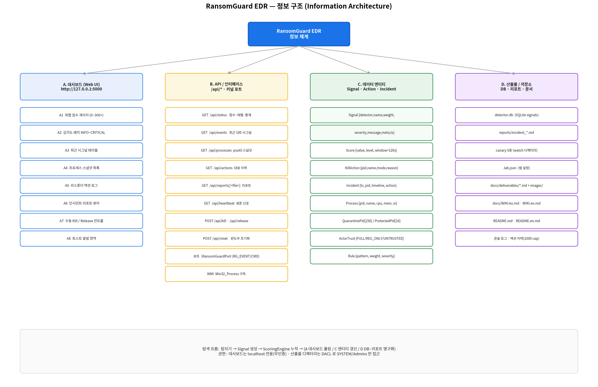

# RansomGuard EDR — 정보 구조 (Information Architecture)

> 시스템이 다루는 **정보(데이터 엔티티) · 화면 · 인터페이스 · 산출물**의 구조를 정리한다.
> 작성일: 2026-06-05 · 대상: Windows 11 x64 · 버전: 0.1 (프로토타입)

---

## 1. 정보 영역 개요 (Top-level)

| 영역 | 이름 | 역할 | 책임 컴포넌트 |
|------|------|------|---------------|
| **A** | 대시보드 (Web UI) | 운영자에게 상태를 시각화하고 수동 제어를 제공 | `dashboard/app.py`, `dashboard/templates/index.html` |
| **B** | API / 인터페이스 | 내부·외부 시스템 간 데이터 교환 통로 | `dashboard/app.py`, `minifilter_bridge.py`, WMI |
| **C** | 데이터 엔티티 | 시스템이 생성·소비하는 핵심 정보 단위 | `scoring.py`, `responder.py`, `incident_report.py` |
| **D** | 산출물 / 저장소 | 영구화되는 데이터·파일·문서 | `event_store.py`, `reports/`, `docs/` |

---

## 2. A — 대시보드 화면 정보 구조

`http://127.0.0.1:5000/` (localhost 전용, 무인증)

| ID | 화면 요소 | 데이터 소스 | 갱신 주기 |
|----|-----------|-------------|-----------|
| A1 | 위협 점수 게이지 (0~300+) | `/api/status` | 폴링 (~2.5s) |
| A2 | 심각도 배지 (INFO~CRITICAL) | `/api/status` | 폴링 |
| A3 | 최근 시그널 테이블 | `/api/events` (최근 100건) | 폴링 |
| A4 | 프로세스 스냅샷 목록 | `/api/processes` (psutil) | 폴링 |
| A5 | 리스폰더 액션 로그 | `/api/actions` (최근 100건) | 폴링 |
| A6 | 인시던트 리포트 뷰어 | `/api/reports`, `/api/reports/<file>` | 온디맨드 |
| A7 | 수동 Kill / Release 컨트롤 | `POST /api/kill`, `/api/release` | 사용자 액션 |
| A8 | 토스트 알림 영역 | `/api/status` 변화 감지 | 10s auto-dismiss |

---

## 3. B — API / 인터페이스 목록

| 분류 | 인터페이스 | 방향 | 페이로드 |
|------|-----------|------|----------|
| HTTP | `GET /api/status` | UI ← Agent | 점수·레벨·통계 |
| HTTP | `GET /api/events` | UI ← Agent | 활성 윈도우 시그널 100건 |
| HTTP | `GET /api/processes` | UI ← Agent | psutil 프로세스 스냅샷 |
| HTTP | `GET /api/actions` | UI ← Agent | 대응 이력 |
| HTTP | `GET /api/reports[/<file>]` | UI ← Agent | 인시던트 MD 목록/본문 |
| HTTP | `GET /api/heartbeat` | Watchdog ← Agent | 생존 신호 (200 OK) |
| HTTP | `POST /api/kill` · `/api/release` | UI → Agent | 수동 대응 명령 |
| HTTP | `POST /api/reset` | UI → Agent | 스코어링 윈도우 초기화 |
| 커널 | `\RansomGuardPort` | 커널 ↔ 유저모드 | `RG_EVENT`(8종) / `RG_COMMAND`(6종) |
| OS | WMI `Win32_Process` 구독 | OS → 유저모드 | 프로세스 생성 이벤트 |

---

## 4. C — 핵심 데이터 엔티티

| 엔티티 | 주요 필드 | 생성 위치 | 소비 위치 |
|--------|-----------|-----------|-----------|
| **Signal** | `detector, name, weight, severity, message, metadata, timestamp` | 각 Detector | ScoringEngine, EventStore, Dashboard |
| **Score** | `value, level, window(120s)` | ScoringEngine | Dashboard, Responder |
| **KillAction** | `pid, name, mode, reason, timestamp` | ProcessResponder | IncidentReporter, Dashboard |
| **Incident** | `timestamp, pid, timeline[], action` | IncidentReporter | `reports/*.md`, Dashboard |
| **Process** | `pid, name, cpu, mem, io_counters` | ProcessWatcher / psutil | Dashboard |
| **QuarantinePid[256]** | PID 비트맵 | 커널 드라이버 | 커널 차단 로직 |
| **ProtectedPid[16]** | 보호 PID 비트맵 | 커널 드라이버 | 핸들 access strip |
| **ActorTrust** | `FULL_TRUST / REGISTRY_ONLY / UNTRUSTED` | actor_trust.py | ScoringEngine |
| **Rule** | `pattern, weight, severity, message` | process_cmdline.py (22개) | Cmdline/Kernel Detector |

---

## 5. D — 산출물 / 저장소

| 산출물 | 경로 | 형식 | 접근 제어 |
|--------|------|------|-----------|
| 이벤트 DB | `detector.db` | SQLite (`signals` 테이블 + 인덱스) | DACL: SYSTEM/Admins |
| 인시던트 리포트 | `reports/incident_<ts>_pid<n>.md` | Markdown | DACL: SYSTEM/Admins |
| Canary 미끼 | watch 디렉터리 내 5종 | docx/xlsx/pdf/txt | — |
| 랩 설정 | `.lab.json` | JSON | — |
| 문서 산출물 | `docs/deliverables/*.md` + `images/` | MD + PNG | — |
| 기술 위키 | `docs/WIKI.ko.md`, `WIKI.en.md` | Markdown | — |
| 프로젝트 개요 | `README.md`, `README.en.md` | Markdown | — |

---

## 6. 정보 흐름 & 권한 원칙

- **흐름**: 탐지기 → `Signal` 생성 → `ScoringEngine` 누적 → (A 대시보드 폴링 / C 엔티티 갱신 / D DB·리포트 영구화)
- **권한**: 대시보드는 localhost 전용 무인증, 산출물 디렉터리(`detector.db`, `reports/`)는 DACL 로 SYSTEM/Admins 만 접근
- **휘발성 vs 영구성**: 스코어링 윈도우(120s)·활성 시그널은 메모리 휘발 / `EventStore`·리포트는 디스크 영구화 (크래시·BSOD 후 사후분석 가능)

---

