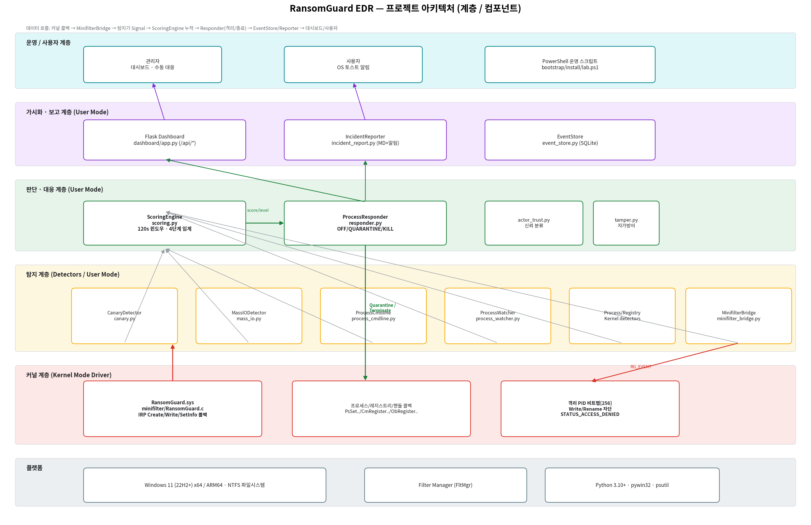

# RansomGuard EDR — 프로젝트 아키텍처

> 시스템을 **계층(Layer) · 컴포넌트 · 데이터 흐름 · 배포** 관점에서 정리한다.
> 작성일: 2026-06-05 · 대상: Windows 11 (22H2+) x64/ARM64 · 버전: 0.1 (프로토타입)

---

## 1. 아키텍처 개요

RansomGuard EDR 은 **커널 minifilter 드라이버(C)** 와 **유저모드 에이전트(Python)** 로 구성된
2-tier EDR 이다. 커널은 파일 I/O·프로세스·레지스트리·핸들을 감시·차단하고, 유저모드는
신호를 수집·스코어링·대응·가시화한다.

| 계층 | 이름 | 주 언어 | 핵심 책임 |
|------|------|---------|-----------|
| L1 | 커널 계층 | C (WDK) | IRP/프로세스/레지스트리/핸들 콜백, PID 격리·차단 |
| L2 | 탐지 계층 | Python | 7종 탐지기 — 행위·미끼·커맨드라인·버스트 분석 |
| L3 | 판단·대응 계층 | Python | 스코어링, 능동 대응, 신뢰 분류, 자가방어 |
| L4 | 가시화·보고 계층 | Python/Flask | 대시보드, 인시던트 리포트, 이벤트 저장 |
| L5 | 운영·사용자 계층 | PowerShell/UI | 설치·랩 스크립트, 관리자·사용자 인터랙션 |
| L0 | 플랫폼 | — | Windows 11, FltMgr, Python 런타임 |

---

## 2. 계층별 컴포넌트

### L1 — 커널 계층 (Kernel Mode Driver)
- **`RansomGuard.sys`** (`minifilter/RansomGuard.c`, 1,293 lines)
  - IRP 콜백: `RgPostCreate`, `RgPreWrite/RgPostWrite`, `RgPreSetInfo/RgPostSetInfo`
  - 프로세스/레지스트리/핸들 콜백: `PsSetCreateProcessNotifyRoutineEx`, `CmRegisterCallbackEx`, `ObRegisterCallbacks`
  - 격리 비트맵 `QuarantinedPids[256]`, 보호 비트맵 `ProtectedPids[16]` (push-lock)
  - 차단 시 `STATUS_ACCESS_DENIED` 반환
  - 통신 포트 `\RansomGuardPort` (altitude 385201, 프로토콜 v2, 50ms 송신 타임아웃)

### L2 — 탐지 계층 (Detectors)
| 컴포넌트 | 파일 | 방식 |
|----------|------|------|
| MinifilterBridge | `detectors/minifilter_bridge.py` | 커널 이벤트 언팩 + 버스트 집계 |
| CanaryDetector | `detectors/canary.py` | 미끼 5종 SHA-256 폴링(1.5s) |
| MassIODetector | `detectors/mass_io.py` | 엔트로피·매직손실·rename·fan-out |
| ProcessCmdlineDetector | `detectors/process_cmdline.py` | WMI + 22개 정규식 룰 |
| ProcessWatcher | `detectors/process_watcher.py` | psutil LOLBin 체인·쓰기 버스트 |
| ProcessKernelDetector | `detectors/process_kernel.py` | 커널 콜백 cmdline 룰 |
| RegistryKernelDetector | `detectors/registry_kernel.py` | 커널 콜백 레지스트리 분류 |

### L3 — 판단·대응 계층
- **`ScoringEngine`** (`scoring.py`): 120초 슬라이딩 윈도우, 4단계 임계(LOW 30 / MED 60 / HIGH 100 / CRIT 150), `forget_pid()` 로 종료 후 점수 회수
- **`ProcessResponder`** (`responder.py`): `OFF / QUARANTINE / KILL` 모드, 상관관계 게이트, `NEVER_KILL` 보호목록, psutil→ctypes 종료 폴백
- **`actor_trust.py`**: 이미지 경로 기반 FULL/REGISTRY_ONLY/UNTRUSTED 신뢰 분류
- **`tamper.py`**: `RtlSetProcessIsCritical`, DACL 강화, 커널 핸들 보호

### L4 — 가시화·보고 계층
- **Flask Dashboard** (`dashboard/app.py`): 10개 `/api/*` 라우트 + SPA
- **IncidentReporter** (`incident_report.py`): MD 리포트 + OS 토스트 알림(rate-limited)
- **EventStore** (`event_store.py`): SQLite `signals` 영구 저장 + 조회

### L5 — 운영·사용자 계층
- PowerShell 스크립트: `bootstrap.ps1`, `install.ps1`, `build_driver.ps1`, `install_services.ps1`, `lab.ps1`
- Windows 서비스: `RansomGuardAgent` + `RansomGuardWatchdog` (LocalSystem, 5s heartbeat 자동 재기동)

---

## 3. 데이터 흐름 (End-to-End)

```
[커널 콜백: Create/Write/SetInfo/Process/Registry/Handle]
        │  RG_EVENT (\RansomGuardPort, 50ms timeout)
        ▼
[MinifilterBridge] ──► [7종 Detector] ──► Signal{weight,severity,…}
        │                                        │
        │                                        ▼
        │                            [ScoringEngine] 120s 윈도우 합산
        │                                        │ score/level
        │                                        ▼
        │                            [ProcessResponder] PID + HIGH/CRIT?
        │                                  │  NEVER_KILL 검사 / 상관관계
        │◄──── RG_COMMAND (Quarantine) ────┤
        │                                  ▼
        │                      quarantine_pid + TerminateProcess
        │                                  │
        ▼                                  ▼
  STATUS_ACCESS_DENIED          [EventStore] [IncidentReporter]
                                       │            │
                                       ▼            ▼
                              [Dashboard /api/*]  [OS 토스트]
                                       │            │
                                  관리자 확인     사용자 인지
```

---

## 4. 배포 구조 (Deployment)

| 프로세스/모듈 | 실행 컨텍스트 | 자동화 |
|---------------|---------------|--------|
| `RansomGuard.sys` | 커널 (테스트서명 또는 attestation 서명) | `build_driver.ps1` → `install_driver.ps1` |
| `RansomGuardAgent` | LocalSystem 서비스 (`agent.py`) | `install_services.ps1` |
| `RansomGuardWatchdog` | LocalSystem 서비스 (`watchdog_service.py`) | `install_services.ps1` |
| Flask Dashboard | Agent 내부 스레드 | `--port 5000` |

---

## 5. 품질 속성 (Quality Attributes)

| 속성 | 설계 결정 |
|------|-----------|
| 성능/안정성 | 커널 송신 50ms 타임아웃 → 유저모드 정체 시에도 IRP 비차단 |
| 응답성 | HIGH/CRITICAL → 격리/종료 1초 이내 |
| 위양성 보호 | `NEVER_KILL` 하드코딩 + 상관관계 게이트 + actor_trust 신뢰분류 |
| 가용성 | Watchdog 5s heartbeat 자동 복구 |
| 변조 저항성 | Process Critical + DACL + 커널 핸들 access strip |
| 메모리 상한 | `MAX_TRACKED_FILES=20000`, 액션 이력 1000건 cap |

---


